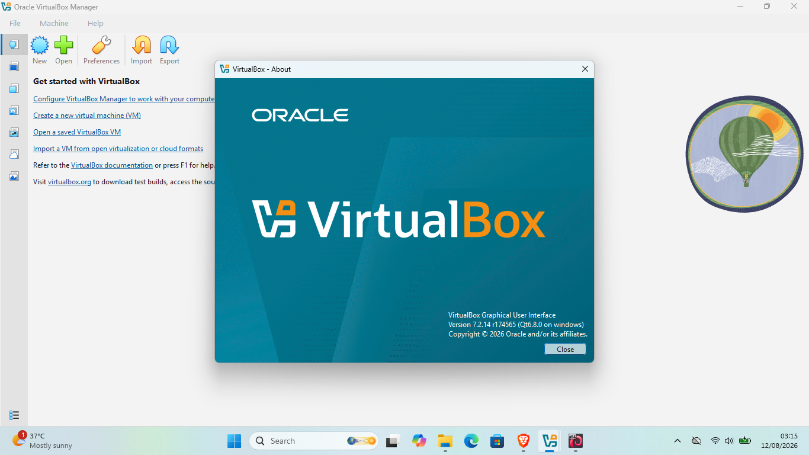
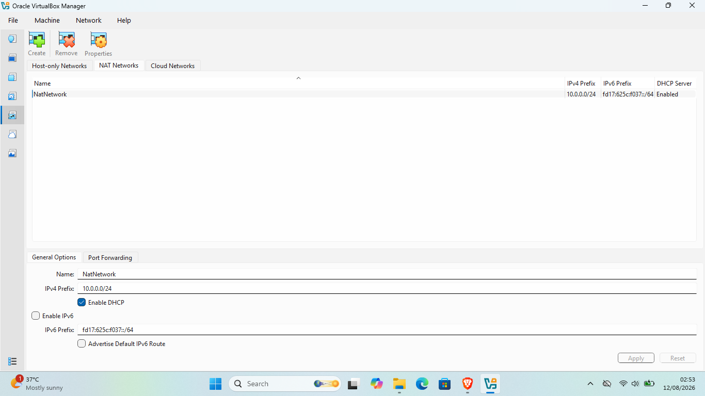

# 🔐 Cybersecurity Lab Environment

### 🧪 Networkwalks B082 • Week 01 • Practical Lab Setup

> **Building a controlled virtual cybersecurity laboratory using Oracle VirtualBox and Kali Linux for networking practice, cybersecurity learning, and authorized security testing.**

---

## 📌 Project Overview

This project is part of my **Week 01 practical work with Networkwalks**.

The main objective was to build a controlled cybersecurity laboratory using **Oracle VirtualBox and Kali Linux**.

The laboratory provides a dedicated environment where I can practice networking concepts, work with cybersecurity tools, perform security-related experiments, and prepare the environment for future practical projects.

The lab uses a private **NAT Network** so that virtual machines can operate within a controlled virtual environment while maintaining the required network connectivity.

---

## 🎯 Project Objectives

The main objectives of this project were to:

- 📦 Download and install 7-Zip.
- ⚙️ Download and install Oracle VirtualBox.
- 🌐 Create and configure a dedicated NAT Network.
- 🔢 Configure the network using `10.0.0.0/24`.
- 🐉 Download and import Kali Linux into VirtualBox.
- 🔌 Connect Kali Linux to the configured NAT Network.
- 🔎 Identify and verify the Kali Linux IP address.
- 📡 Verify communication with the virtual gateway.
- 🌍 Verify Internet connectivity.
- 💾 Create a clean virtual machine snapshot.
- 📸 Document the complete setup using screenshots.
- 📝 Record the configuration and verification process.
- 🚀 Prepare the laboratory for future cybersecurity practicals.

---

# 🛡️ Purpose of the Lab

A cybersecurity laboratory provides a controlled environment where cybersecurity concepts and tools can be practiced without directly testing unauthorized systems.

This laboratory can be used for:

- 🔎 Network reconnaissance
- 📡 Network and port scanning
- 🛡️ Vulnerability assessment
- 📦 Packet analysis
- 🌐 Web security testing
- 🧪 Security tool practice
- 🐧 Linux and networking practice
- 🚀 Future cybersecurity projects

The use of a virtual laboratory provides a controlled environment where experiments can be performed repeatedly and the virtual machine can be restored when necessary.

> ⚠️ **Ethical Notice:** This laboratory is intended for educational purposes and authorized security testing only. Security testing must only be performed against systems that I own or have explicit permission to test.

---

# 🏗️ Lab Architecture

### 🖥️ Host Machine
**Windows 11 Home**  
Intel Core i5-5200U • 8 GB RAM

⬇️

### ⚙️ Virtualization Layer
**Oracle VirtualBox 7.2.14**

⬇️

### 🐉 Cybersecurity VM
**Kali Linux 2026.2**  
IP Address: `10.0.0.3`

⬇️

### 🌐 Virtual Network
**NAT Network**  
Network: `10.0.0.0/24`  
Gateway: `10.0.0.1`

⬇️

### 🌍 External Connectivity
**Internet**

---

> **Current Lab:** 1 Host → 1 Virtual Machine → 1 NAT Network
>
> **Future Expansion:** Additional attacker/target VMs can be connected to the same `10.0.0.0/24` network for authorized cybersecurity exercises.

## ⚙️ Lab Environment

🖥️ **Host OS**  Windows 11 Home  
🧠 **Host RAM**  8 GB  
⚡ **Processor**  Intel Core i5-5200U @ 2.20 GHz  
🧰 **Hypervisor**  Oracle VirtualBox 7.2.14  
🐉 **Security OS**  Kali GNU/Linux Rolling 2026.2  
🧠 **Kali RAM**  4 GB  
🌐 **Virtual Network**  NAT Network  
📡 **Network Address**  10.0.0.0/24  
🐧 **Kali IP Address**  10.0.0.3/24  
🚪 **Default Gateway**  10.0.0.1  
🔮 **Future VM Range**  10.0.0.4–10.0.0.99  

# 🪜 PHASE 1 — CYBERSECURITY LAB SETUP

> 🧠 **LEARN → ⚙️ BUILD → 🔎 TEST → 🛡️ VERIFY → 📚 DOCUMENT**

The first phase focused on building the basic cybersecurity laboratory environment, from installing the required software to configuring Kali Linux and preparing the virtual network.

## 📦 Step 1 — Download & Install 7-Zip
I downloaded and installed **7-Zip** as part of the initial laboratory setup.

### 🎯 Purpose
7-Zip was used to extract compressed files required during the Kali Linux and virtual machine setup.

### 📸 Evidence

## ⚙️ Step 2 — Download & Install Oracle VirtualBox

### 🎯 Purpose
Using VirtualBox allows me to create a separate environment for cybersecurity learning and practical exercises.

### 📸 Evidence

## 🌐 Step 3 — Configure the NAT Network

### 🎯 Purpose

The NAT Network provides a private virtual network for the lab. It allows virtual machines connected to the same network to communicate with each other while also providing Internet connectivity.

### 📸 Evidence

## 🐉 Step 4 — Download & Import Kali Linux
### 🎯 Purpose

Kali Linux provides the tools and environment required for practicing cybersecurity, networking, penetration testing, and other authorized security exercises.

### 📸 Evidence

