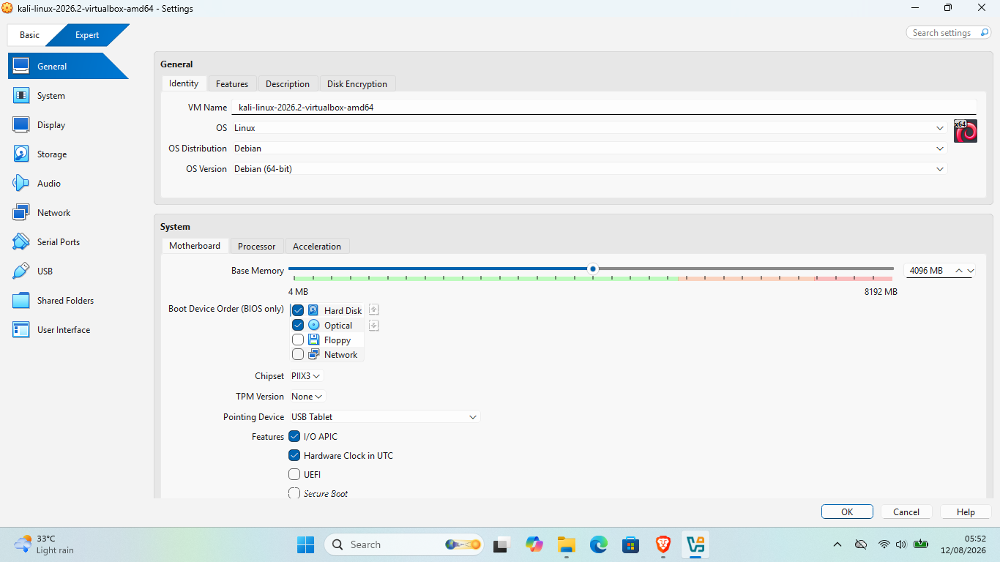
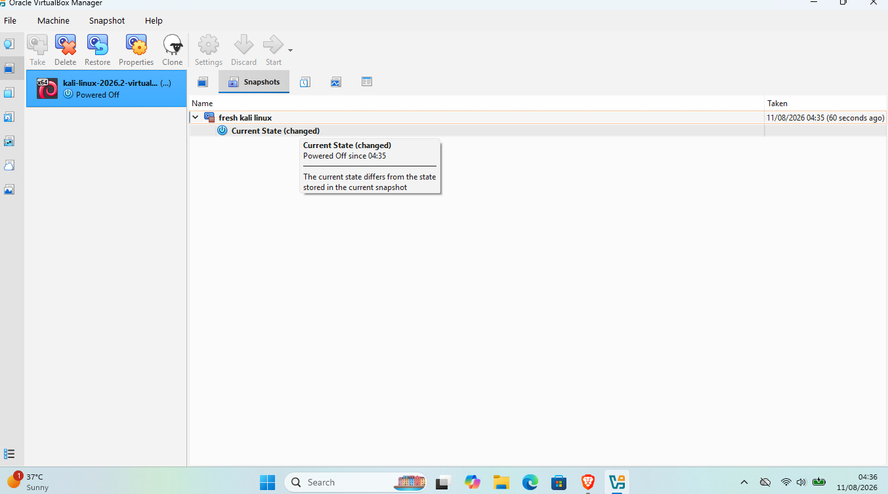

# 🔐 Cybersecurity Lab Environment

### 🧪 Networkwalks B082 • Week 01 • Practical Lab Setup

> **Building a controlled virtual cybersecurity laboratory using Oracle VirtualBox and Kali Linux for networking practice, cybersecurity learning, and authorized security testing.**

---

## 📌 Project Overview

This project is part of my **Week 01 practical work with Networkwalks**.

The main objective was to build a controlled cybersecurity laboratory using **Oracle VirtualBox and Kali Linux**.

The laboratory provides a dedicated environment where I can practice networking concepts, work with cybersecurity tools, perform security-related experiments, and prepare the environment for future practical projects.

The lab uses a private **NAT Network** so that virtual machines can operate within a controlled virtual environment while maintaining the required network connectivity.

---

## 🎯 Project Objectives

The main objectives of this project were to:

- 📦 Download and install 7-Zip.
- ⚙️ Download and install Oracle VirtualBox.
- 🌐 Create and configure a dedicated NAT Network.
- 🔢 Configure the network using `10.0.0.0/24`.
- 🐉 Download and import Kali Linux into VirtualBox.
- 🔌 Connect Kali Linux to the configured NAT Network.
- 🔎 Identify and verify the Kali Linux IP address.
- 📡 Verify communication with the virtual gateway.
- 🌍 Verify Internet connectivity.
- 💾 Create a clean virtual machine snapshot.
- 📸 Document the complete setup using screenshots.
- 📝 Record the configuration and verification process.
- 🚀 Prepare the laboratory for future cybersecurity practicals.

---

# 🛡️ Purpose of the Lab

A cybersecurity laboratory provides a controlled environment where cybersecurity concepts and tools can be practiced without directly testing unauthorized systems.

This laboratory can be used for:

- 🔎 Network reconnaissance
- 📡 Network and port scanning
- 🛡️ Vulnerability assessment
- 📦 Packet analysis
- 🌐 Web security testing
- 🧪 Security tool practice
- 🐧 Linux and networking practice
- 🚀 Future cybersecurity projects

The use of a virtual laboratory provides a controlled environment where experiments can be performed repeatedly and the virtual machine can be restored when necessary.

> ⚠️ **Ethical Notice:** This laboratory is intended for educational purposes and authorized security testing only. Security testing must only be performed against systems that I own or have explicit permission to test.

---

# 🏗️ Lab Architecture

### 🖥️ Host Machine
**Windows 11 Home**  
Intel Core i5-5200U • 8 GB RAM

⬇️

### ⚙️ Virtualization Layer
**Oracle VirtualBox 7.2.14**

⬇️

### 🐉 Cybersecurity VM
**Kali Linux 2026.2**  
IP Address: `10.0.0.3`

⬇️

### 🌐 Virtual Network
**NAT Network**  
Network: `10.0.0.0/24`  
Gateway: `10.0.0.1`

⬇️

### 🌍 External Connectivity
**Internet**

---

> **Current Lab:** 1 Host → 1 Virtual Machine → 1 NAT Network
>
> **Future Expansion:** Additional attacker/target VMs can be connected to the same `10.0.0.0/24` network for authorized cybersecurity exercises.

## ⚙️ Lab Environment

🖥️ **Host OS**  Windows 11 Home  
🧠 **Host RAM**  8 GB  
⚡ **Processor**  Intel Core i5-5200U @ 2.20 GHz  
🧰 **Hypervisor**  Oracle VirtualBox 7.2.14  
🐉 **Security OS**  Kali GNU/Linux Rolling 2026.2  
🧠 **Kali RAM**  4 GB  
🌐 **Virtual Network**  NAT Network  
📡 **Network Address**  10.0.0.0/24  
🐧 **Kali IP Address**  10.0.0.3/24  
🚪 **Default Gateway**  10.0.0.1  
🔮 **Future VM Range**  10.0.0.4–10.0.0.99  

# 🪜 PHASE 1 — CYBERSECURITY LAB SETUP

> 🧠 **LEARN → ⚙️ BUILD → 🔎 TEST → 🛡️ VERIFY → 📚 DOCUMENT**

The first phase focused on building the basic cybersecurity laboratory environment, from installing the required software to configuring Kali Linux and preparing the virtual network.

## 📦 Step 1 — Download & Install 7-Zip
I downloaded and installed **7-Zip** as part of the initial laboratory setup.

### 🎯 Purpose
7-Zip was used to extract compressed files required during the Kali Linux and virtual machine setup.

### 📸 Evidence

## ⚙️ Step 2 — Download & Install Oracle VirtualBox

### 🎯 Purpose
Using VirtualBox allows me to create a separate environment for cybersecurity learning and practical exercises.

### 📸 Evidence

## 🌐 Step 3 — Configure the NAT Network

### 🎯 Purpose

The NAT Network provides a private virtual network for the lab. It allows virtual machines connected to the same network to communicate with each other while also providing Internet connectivity.

### 📸 Evidence

## 🐉 Step 4 — Download & Import Kali Linux
### 🎯 Purpose

Kali Linux provides the tools and environment required for practicing cybersecurity, networking, penetration testing, and other authorized security exercises.

### 📸 Evidence

## 🔌 Step 5 — Configure & Verify Kali Network

After starting Kali Linux, I configured and verified the network connection to ensure that the virtual machine was connected to the correct NAT Network.

### 🔍 1. Check IP Configuration

I used the following command:

ip addr show:
### 📸 Evidence

### ⚙️ 2. Configure DNS

I opened **Edit Connections → IPv4 Settings** and configured the DNS server as:
8.8.8.8

### 📸 Evidence

### 🌐 3. Test Internet Connectivity

I verified the Internet connectivity of the Kali virtual machine using the following command:
ping -c 4 8.8.8.8

### 📸 Evidence

## 💾 Step 6 — Create VirtualBox Snapshot

After completing the Kali Linux network configuration and connectivity testing, I created a VirtualBox snapshot to preserve the current working state of the virtual machine.

The snapshot was named:
fresh kali linux

### 📸 Evidence

# 🐞 Problems & Solutions

## Understanding VirtualBox Networking

One of the challenging parts of this project was understanding how Kali Linux could communicate with the Internet even though Kali's IP address is different from the IP address used by the Windows host.

During the setup, I learned that Kali Linux operates inside the private virtual network created by VirtualBox.

The basic flow is:

🐉 Kali Linux
10.0.0.3
      │
      ▼
🌐 VirtualBox NAT Network
10.0.0.0/24
      │
      ▼
🚪 Gateway
10.0.0.1
      │
      ▼
🖥️ Windows Host
      │
      ▼
🌍 Internet

# 🎓 Lessons Learned

During this project, I learned how to set up, configure, and verify a Kali Linux virtual machine using VirtualBox. I also gained a better understanding of basic networking, virtualization, and troubleshooting.

## 🔹 What I Learned:

- Learned how to install and configure **Kali Linux** in VirtualBox.
- Learned the difference between **NAT** and **NAT Network** in VirtualBox and when each networking mode can be used.
- Learned how to create and configure a **VirtualBox NAT Network**.
- Learned how a virtual machine communicates through a **private network** while accessing the Internet.
- Learned how to configure and verify **IPv4 addressing, subnet masks, gateways, and DNS settings** in Kali Linux.
- Learned how to check network interfaces and IP addresses using the `ip addr show` command.
- Learned about the `10.0.0.0/24` network and how IP addresses are assigned within the network.
- Learned about the role of the **default gateway** in allowing the Kali VM to communicate outside its local network.
- Learned about Google's public DNS server `8.8.8.8`.
- Learned how to test Internet connectivity using the `ping -c 4 8.8.8.8` command.
- Learned how **Kali Linux, the NAT Network, gateway, Windows host, and Internet** work together.
- Learned how to create a **VirtualBox snapshot** to preserve a working state of the virtual machine.
- Learned the importance of documenting technical work with **screenshots and clear explanations**.
- Improved my understanding of **Linux networking, virtualization, IP addressing, DNS, NAT, and basic troubleshooting**.
- Prepared a working Kali Linux environment for future **cybersecurity labs, networking exercises, and penetration-testing practice**.

## 🚀 Overall Learning

This project helped me build a strong foundation in virtual machine setup, Linux networking, and troubleshooting. The environment is now ready for future cybersecurity projects and practical labs.

## 🔐 Security & Ethical Use

This project was created strictly for **educational and authorized cybersecurity practice**. All activities were performed in a controlled laboratory environment for learning purposes. No unauthorized systems or networks were targeted.

## 🛠️ Tools & Resources

The following tools and resources were used during this project:

- **7-Zip:** https://7-zip.org/download.html
- **Oracle VirtualBox:** https://virtualbox.org/wiki/Downloads
- **Kali Linux:** https://kali.org/get-kali

## 👤 About the Author

**Prince Chaudhary**  
Cybersecurity Student | BSc Cybersecurity

This project is part of my practical cybersecurity learning journey, where I am developing hands-on skills in Linux, networking, virtualization, and penetration testing.

🔗 **LinkedIn:** https://www.linkedin.com/in/prince-chaudhary-307a053b6/

## 📌 Project Details

**Program:** Cybersecurity Internship at Network Walk Academy  
**Week:** 01  
**Project:** Cybersecurity & Penetration Testing Lab Setup  
**Purpose:** Setting up and documenting a controlled cybersecurity laboratory environment  
**Repository:** GitHub

